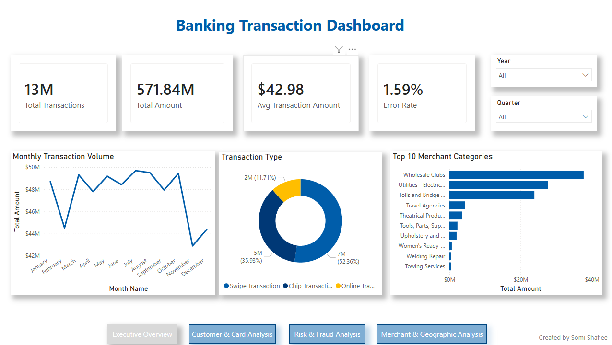
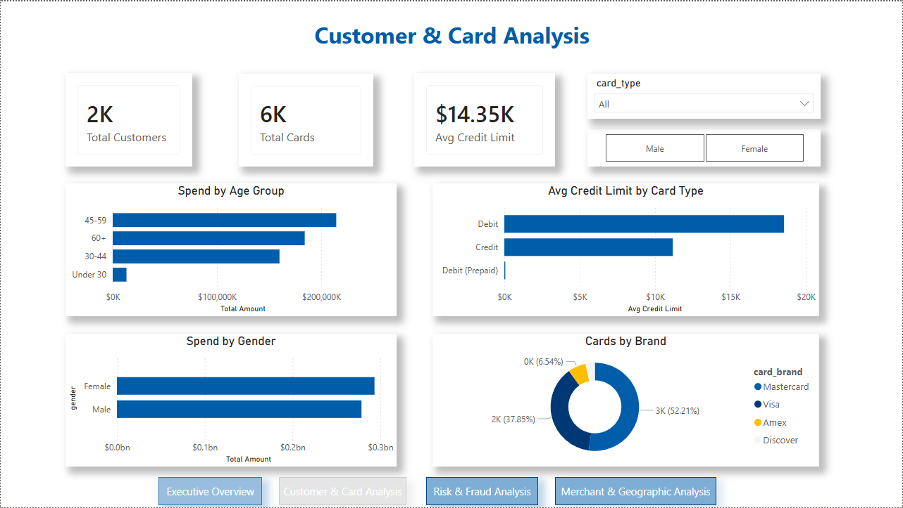
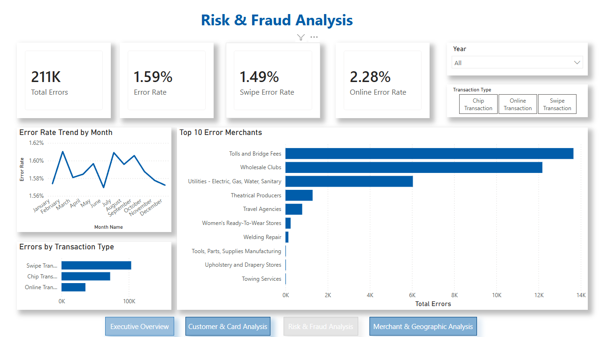
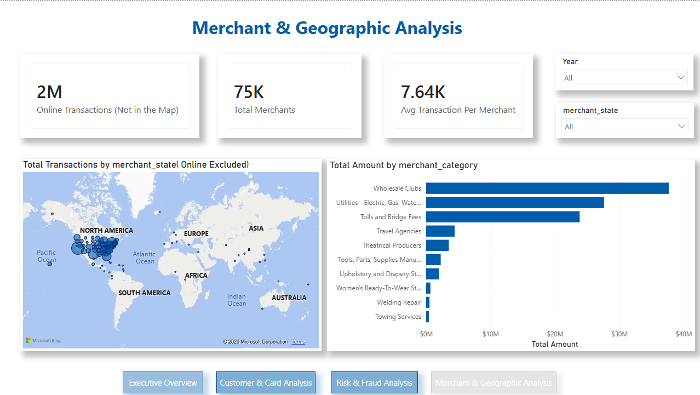

# 🏦 Banking Transaction Dashboard — Power BI

A professional 4-page interactive banking dashboard built with Power BI, analyzing **13 million+ real transactions** across customers, cards, merchants, and risk metrics.



---

## 📊 Dashboard Pages

### Page 1 — Executive Overview
High-level KPIs and transaction trends for executive-level reporting.


### Page 2 — Customer & Card Analysis
Customer demographics, card brand distribution, and spending behavior by age group and gender.



### Page 3 — Risk & Fraud Analysis
Error rate trends, high-risk merchants, and transaction type risk comparison.



### Page 4 — Merchant & Geographic Analysis
US state transaction map, top merchant categories, and online vs physical spend breakdown.



---

## 🔍 Key Insights

- 🔴 **Online transactions have a 53% higher error rate** than physical swipes (2.28% vs 1.49%)
- 💳 **Mastercard dominates** at 52% of all cards vs Visa at 38%
- 👥 **The 45–59 age group** drives the most spending — prime banking segment
- 🏪 **Wholesale Clubs** is the #1 merchant category by transaction volume
- 🌐 **2M online transactions** excluded from geographic map — transparently noted

---

## 🛠️ Technical Stack

| Tool | Usage |
|------|-------|
| **Power BI Desktop** | Report building, DAX, data modeling |
| **Power Query (M)** | Data cleaning, JSON parsing, transformations |
| **DAX** | 15+ measures including CALCULATE, time intelligence |
| **Star Schema** | 4-table relational data model |

---

## 📁 Data Model

```
users_data (1)
     ↓
cards_data (1) ──→ transactions_data (*)
                          ↑
                    mcc_codes (1)

Calendar ──→ transactions_data
```

### Tables

| Table | Rows | Role |
|-------|------|------|
| `transactions_data` | 13,305,915 | Fact Table |
| `cards_data` | 6,146 | Dimension |
| `users_data` | 2,000 | Dimension |
| `mcc_codes` | 109 | Lookup |
| `Calendar` | 3,591 | Date Table |

---

## ⚙️ Power Query Transformations

- Removed currency symbols ($) from income and credit limit columns
- Converted MM/YYYY date formats to proper Date type
- Fixed zip codes from decimal (58523.0) to text format
- Parsed JSON mcc_codes using `Record.ToTable()` via Advanced Editor
- Split DateTime into separate `date` and `transaction_time` columns
- Replaced 0/1 binary flags with meaningful Yes/No labels
- Removed irrelevant columns (card_on_dark_web, RowNumber, Surname)

---

## 📐 DAX Measures

### Core KPIs
```dax
Total Transactions = COUNTROWS(transactions_data)

Total Amount = SUM(transactions_data[amount])

Avg Transaction Amount = AVERAGE(transactions_data[amount])

Error Rate = DIVIDE([Total Errors], [Total Transactions], 0)
```

### CALCULATE Measures
```dax
Online Amount = 
CALCULATE(
    SUM(transactions_data[amount]),
    transactions_data[use_chip] = "Online Transaction"
)

Female Amount = 
CALCULATE(
    SUM(transactions_data[amount]),
    users_data[gender] = "Female"
)
```

### Time Intelligence
```dax
YTD Amount = 
TOTALYTD(SUM(transactions_data[amount]), 'Calendar'[Date])

PY Amount = 
CALCULATE(
    SUM(transactions_data[amount]),
    SAMEPERIODLASTYEAR('Calendar'[Date])
)

YoY Growth = 
DIVIDE([Total Amount] - [PY Amount], [PY Amount], 0)
```

### Risk Measures
```dax
Online Error Rate = 
DIVIDE(
    CALCULATE([Total Errors], 
    transactions_data[use_chip] = "Online Transaction"),
    CALCULATE([Total Transactions],
    transactions_data[use_chip] = "Online Transaction"),
    0)
```

---

## 📂 Repository Structure

```
Banking-Transaction-Dashboard/
│
├── Banking_Transaction_Dashboard_PowerBI.pdf          # Power BI file
├── README.md                                          # This file
│
├── screenshots/
│   ├── page1.png                                      # Executive Overview
│   ├── page2.png                                      # Customer & Card Analysis
│   ├── page3.png                                      # Risk & Fraud Analysis
│   └── page4.png                                      # Merchant & Geographic Analysis
│
└── data/
    └── source_links.md                                # Kaggle dataset links
```

---

## 🗃️ Dataset

**Source:** [Financial Transactions Dataset — Kaggle](https://www.kaggle.com/datasets/computingvictor/transactions-fraud-datasets)

| File | Size | Description |
|------|------|-------------|
| transactions_data.csv | 1.2 GB | 13M+ transaction records |
| cards_data.csv | 498 MB | Card details per customer |
| users_data.csv | 161 KB | Customer demographics |
| mcc_codes.json | 5 KB | Merchant category lookup |

---

## 🎨 Design

- **Color Theme:** RBC Royal Blue (#005DAA) with gold accents (#FFBE00)
- **Background:** Light grey (#F5F5F5)
- **Navigation:** Custom buttons on every page for seamless navigation
- **Slicers:** Year, Quarter, Gender, Card Type, Transaction Type, State

---

## 💡 What I Learned

This project taught me the full Power BI workflow:

1. **Connecting & shaping** — handling JSON, large CSVs, date/time splitting
2. **Data modeling** — star schema, relationship cardinality, filter flow
3. **DAX** — CALCULATE, FILTER, time intelligence, iterator functions
4. **Visualization** — dashboard design, slicer interactions, map visuals
5. **Real data challenges** — null handling, online vs physical transactions, data type issues

---

## 👩‍💻 About Me

**Somayeh (Somi) Hajishafiee**
Data & Business Analyst | Toronto, Canada

Actively seeking Data Analyst and BI Analyst roles in Canadian banking.

[](https://www.linkedin.com/in/somi-shafiee89/)
[](https://github.com/smyh1989)

---

*Built with ❤️ in Toronto, 2026*
